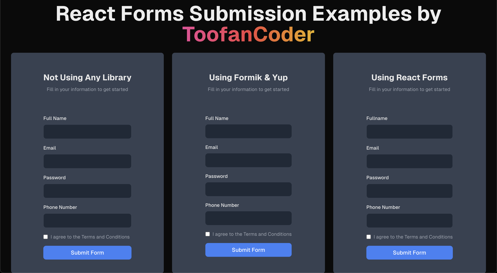

# Form Management with NextJS
Discover three effective methods for handling form submissions in NextJS, including validation and state management. Learn how to use Formik, Yup, and React Hook Form to handle forms.




### Head over to the blog post if you want to learn more: [Form Management with NextJS](https://www.toofancoder.com/blog/3-ways-to-form-submission-nextjs)

# Getting Started

```bash
npm install --legacy-peer-deps
npm run dev
```
